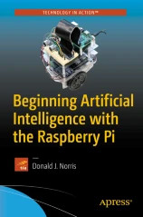

# Community

**Do you have a project, video or publication that uses/mentions PySwip?**
**[file an issue](https://github.com/yuce/pyswip/issues/new?title=Powered%20by%20PySwip) or send a pull request.**

If you would like to reference PySwip in a LaTeX document, you can use the provided [BibTeX file](pyswip.bibtex).

## Help!

* [Google Groups](https://groups.google.com/forum/#!forum/pyswip)
* [Stack Overflow](https://stackoverflow.com/search?q=pyswip)

## Companies Using PySwip

* [Magazino GmbH](https://www.magazino.eu/?lang=en) Magazino develops and builds intelligent, mobile robots for intralogistics.

## Books

[Beginning Artificial Intelligence with the Raspberry Pi](https://link.springer.com/book/10.1007/978-1-4842-2743-5)

## Publications

### 2026

* [Compliance as a Trust Metric](https://arxiv.org/pdf/2601.01287v1) (PDF)

### 2025

* [On Bridging Prolog and Python to Enhance an Inductive Logic Programming System](https://link.springer.com/chapter/10.1007/978-3-031-84924-4_1)
* [Logical Lease Litigation: Prolog and LLMs for Rental Law Compliance in New York](https://arxiv.org/abs/2502.09204)
* [Towards Safe Autonomous Driving Policies Using a Neuro-Symbolic Deep Reinforcement Learning Approach](https://arxiv.org/pdf/2307.01316) (PDF) ([Code](https://github.com/CAV-Research-Lab/Safe-Reinforcement-Learning-using-Symbolic-Logical-Programming-for-Autonomous-Highway-Driving))
* [Neuro-Symbolic Integration Brings Causal and Reliable Reasoning Proofs](https://arxiv.org/pdf/2311.09802) (PDF) ([Code](https://github.com/DAMO-NLP-SG/CaRing))
* [ViLLa: A Neuro-Symbolic approach for Animal Monitoring](https://arxiv.org/abs/2506.14823v1)
* [From Reasoning to Code: GRPO Optimization for Underrepresented Languages](https://arxiv.org/abs/2506.11027)
* [Integrating expert knowledge with machine learning for AI-based stroke identifications and treatment systems](https://pmc.ncbi.nlm.nih.gov/articles/PMC12048753/)

### 2024

* [Development of a Prototype of a Medical Application Using a Type-2 Fuzzy Inference System](https://www.researchgate.net/publication/377771997_Development_of_a_Prototype_of_a_Medical_Application_Using_a_Type-2_Fuzzy_Inference_System)
* [Faithful Logical Reasoning via Symbolic Chain-of-Thought](https://arxiv.org/pdf/2405.18357) (PDF) ([Code](https://github.com/Aiden0526/SymbCoT))
* [Ambiguity-Aware Abductive Learning](https://www.lamda.nju.edu.cn/xiez/assets/pdf/icml24-hehy.pdf) (PDF) ([Code](https://github.com/Hao-Yuan-He/A3BL))
* [Interactive Evolution: A Neural-Symbolic Self-Training Framework For Large Language Models](https://arxiv.org/pdf/2406.11736) (PDF) ([Code](https://github.com/xufangzhi/ENVISIONS))
* [Development of a Prototype of a Medical Application Using a Type-2 Fuzzy Inference System](https://link.springer.com/chapter/10.1007/978-3-031-51521-7_20)

### 2023

* [Learning Where and When to Reason in Neuro-Symbolic Inference](https://openreview.net/pdf?id=en9V5F8PR-) (PDF)
* [MMDect: Metamorphic Malware Detection Using Logic Programming](http://platon.etsii.urjc.es/~jarias/tfg/23-Luciana.pdf) (PDF)
* [Continuous QoS-compliant orchestration in the Cloud-Edge continuum](https://arxiv.org/pdf/2310.02985) (PDF) ([Code](https://github.com/di-unipi-socc/FogArm))
* [Logic-LM: Empowering Large Language Models with Symbolic Solvers for Faithful Logical Reasoning](https://arxiv.org/pdf/2305.12295) (PDF) ([Code](https://github.com/teacherpeterpan/Logic-LLM))
* [Learning MDL Logic Programs From Noisy Data](https://arxiv.org/pdf/2308.09393) (PDF) ([Code](https://github.com/celinehocquette/aaai24-maxsynth))
* [Few-Shot Learning for Plant Disease Classification Using ILP](https://link.springer.com/chapter/10.1007/978-3-031-35641-4_26)

### 2022

* [ProPy: Prolog-based Fault Localization Tool for Python](https://ieeexplore.ieee.org/document/9825788)
* [Building a Fuzzy Expert System for Assessing the Severity of Pneumonia](https://www.researchgate.net/publication/363190862_Building_a_Fuzzy_Expert_System_for_Assessing_the_Severity_of_Pneumonia)
* [Towards a Competitive 3-Player Mahjong AI using Deep Reinforcement Learning](https://victorzxy.github.io/publication/2022-meowjong-auxiliary/Towards_a_Competitive_3-Player_Mahjong_AI_using_Deep_Reinforcement_Learning.pdf) (PDF) ([Code](https://github.com/VictorZXY/Meowjong))
* [Learning programs with magic values](https://arxiv.org/pdf/2208.03238) (PDF) ([Code](https://github.com/celinehocquette/magicpopper))
* [Building a Fuzzy Expert System for Assessing the Severity of Pneumonia](https://link.springer.com/chapter/10.1007/978-3-031-16075-2_27)

### 2021

* [Deep Reinforcement Learning for Mahjong](https://victorzxy.github.io/project/meowjong/BA-Dissertation-Meowjong.pdf) (PDF)
* [Neural probabilistic logic programming in DeepProbLog](https://www.sciencedirect.com/science/article/abs/pii/S0004370221000552) ([Code](https://github.com/ML-KULeuven/deepproblog))
* [Span-based Semantic Parsing for Compositional Generalization](https://aclanthology.org/2021.acl-long.74.pdf) (PDF) ([Code](https://github.com/jonathanherzig/span-based-sp))
* [Ordering Subgoals in a Backward Chaining Prover](https://aitp-conference.org/2021/abstract/paper_14.pdf)

### 2020

* [Fact-Based Expert System for Supplier Selection with ERP Data](https://link.springer.com/chapter/10.1007/978-981-15-1041-0_3)
* [Interactive Text Graph Mining with a Prolog-based Dialog Engine](https://link.springer.com/chapter/10.1007/978-3-030-39197-3_1)
* [Information Retrieval Based on Knowledge-Enhanced Word Embedding Through Dialog: A Case Study](https://www.atlantis-press.com/journals/ijcis/125936225/view)

### 2019

* [The Detection Of Conflicts In The Requirements Specification Based On An Ontological Model And A Production Rule System](https://www.researchgate.net/publication/337655252_The_detection_of_conflicts_in_the_requirements_specification_based_on_an_ontological_model_and_a_production_rule_system)
* [Dependency-based Text Graphs for Keyphrase and Summary Extraction with Applications to Interactive Content Retrieval](https://arxiv.org/pdf/1909.09742.pdf) (PDF)

### 2018

* [Semi-automatically Augmenting Attack Trees using an Annotated Attack Tree Library](https://www.researchgate.net/publication/327985985_Semi-automatically_Augmenting_Attack_Trees_Using_an_Annotated_Attack_Tree_Library)
* [DeepProbLog: Neural Probabilistic Logic Programming](https://papers.nips.cc/paper/2018/hash/dc5d637ed5e62c36ecb73b654b05ba2a-Abstract.html)

### 2017

* [Assessment of Graph Databases as a Viable Materiel Solution for the Army's Dynamic Force Structure (DFS) Portal Implementation: Part 3, Risks, Mitigation Approach, and Roadmap](https://www.researchgate.net/publication/321977892_Assessment_of_Graph_Databases_as_a_Viable_Materiel_Solution_for_the_Army's_Dynamic_Force_Structure_DFS_Portal_Implementation_Part_3_Risks_Mitigation_Approach_and_Roadmap_Assessment_of_Graph_Databases_)
* [Integration von Prolog und ClioPatria in Python](http://www1.pub.informatik.uni-wuerzburg.de/pub/theses/2017-bodenlos-master.pdf) (PDF, German)
* [Implementation on ADHD Diagnostic Expert System based on DSM Diagnostic Criteria](https://www.kci.go.kr/kciportal/landing/article.kci?arti_id=ART002285624) (Korean)
* [Wie sehen Krebsmolekule aus? Vergleich der Gute der Klassifizierung potenziell krebserregender Molekule durch induktiv logische und merkmalsbasierte Lernverfahren](http://www.cogsys.wiai.uni-bamberg.de/teaching/ss17/pj_bama/ProjektberichtRelLearningFinzelGrabeHillebrandHornigRicci.pdf) (PDF, German)

### 2016

* [Tackling Complexity in High Performance Computing Applications](https://link.springer.com/article/10.1007/s10766-016-0422-9)
* [Social Human-Robot Interaction: A New Cognitive and Affective Interaction-Oriented Architecture](https://link.springer.com/chapter/10.1007/978-3-319-47437-3_25)
* [A Concept for Declarative Information Acquisition in Smart Environments](https://d-nb.info/1122172583/34) (PDF)

### 2015

* [SELECTSCRIPT: A Query Language for Robotic World Models and Simulations](https://ieeexplore.ieee.org/document/7140077/)
* [Companion Robots Behaving with Style: Towards Plasticity in Social Human-Robot Interaction](https://tel.archives-ouvertes.fr/tel-01679314/document) (PDF)
* [A Learning Framework for Tool Creation by a Robot](http://www.araa.asn.au/acra/acra2015/papers/pap145.pdf) (PDF)

### 2014

* [A Planning Module for a ROS-Based Ubiquitous Robot Control System](https://studenttheses.uu.nl/bitstream/handle/20.500.12932/16508/2014-03-27%20MSc%20Thesis%20Pieterjan%20van%20Gastel.pdf?sequence=2&isAllowed=y) (PDF)

### 2013

* [A pilot framework developed as a common platform integrating diverse elements of computer aided fixture design](https://www.tandfonline.com/doi/full/10.1080/00207543.2013.832000)

### 2010

* [Conceptual Maps as the First Step in an Ontology Construction Method](https://ieeexplore.ieee.org/abstract/document/5629027)

## Blog Posts

### 2026

* [Neurosymbolic AI: The Bridge Between Deep Learning and Symbolic Reasoning](https://atalupadhyay.wordpress.com/2026/01/06/neurosymbolic-ai-the-bridge-between-deep-learning-and-symbolic-reasoning/)

### 2025

* [Implementing Prolog in Python Using VS Code and Google Colab](https://medium.com/@alihassanshahid/implementing-prolog-in-python-using-vs-code-and-colab-e0f5c9adce02)
* [A Coding Guide to Build a Tool-Calling ReAct Agent Fusing Prolog Logic with Gemini and LangGraph](https://www.marktechpost.com/2025/07/24/a-coding-guide-to-build-a-tool-calling-react-agent-fusing-prolog-logic-with-gemini-and-langgraph/)
* [Neurosymbolic AI for Data Industry: End-to-End Guide for Domain-Based Models](https://www.linkedin.com/pulse/neurosymbolic-ai-data-industry-end-to-end-guide-abbas-moynudeen-nzpwc) (Linkedin)

### 2024

* [Playing with Prolog – Prolog’s Role in the LLM Era, Part 3](https://eugeneasahara.com/2024/08/12/playing-with-prolog-prologs-role-in-the-llm-era-part-3/)
* [Prolog and ML Models – Prolog’s Role in the LLM Era, Part 4](https://eugeneasahara.com/2024/08/15/prolog-and-ml-models-prologs-role-in-the-llm-era-part-4/)

### 2021

* [Exploring the world of declarative programming](https://fedoramagazine.org/exploring-the-world-of-declarative-programming/)

### 2019

* [10 minutes to make a GUI for your SWI-Prolog App via Python](https://pbrown.me/blog/quick-gui/)

### 2018

* [Path Follower: Arduino+Rasp on ROS](https://giacomocerquone.com/blog/path-follower-maze-solving-car-arduino/) and its [Project code](https://github.com/giacomocerquone/robotics-MazeSolver)

### 2013

* [Calling Prolog from Python](http://fernmac.blogspot.com.tr/2013/07/calling-prolog-from-python.html)

## Other Documents

* [Prolog - Gateway to Logic Programming](https://sut-ai.github.io/supplementary/notebooks/logic_programming/)

## Projects

* [noworkflow](https://github.com/gems-uff/noworkflow) Supporting infrastructure to run scientific experiments without a scientific workflow management system. http://gems-uff.github.io/noworkflow
* [Super Pacman](https://github.com/kajornsakp/prologProject)
* [Pokemon Weak Detector](https://github.com/ReiiYuki/PokemonWeakDetector)
* [Food Recommendations in Hyderabad, India](https://github.com/cindyleowtt/prolog_food) Food Recommendation AI Expert System using a GUI hosted on Flask and a backend developed with PYSWIP and native Prolog.
* [pyswip_envctrl](https://github.com/2rs2ts/pyswip_envctrl) An environment control module expert system written in PySwip.
* [tic-tac-toe](https://github.com/ivpusic/tic-tac-toe) Tic-tac-toe game with AI in Prolog and GUI in Python (kivy framework + pyswip).
* [TBM1 - "Getting to Know My Home"](http://thewiki.rockinrobotchallenge.eu/index.php?title=TBM1_-_“Getting_to_Know_My_Home”)
* [Prolog natural language parsing component to control a Scribbler II robot over bluetooth](http://justinmangue.com/blog/scribpro-py/)
* [Cosmos](https://github.com/mcsoto/cosmos) A new logic programming language.
* [lib-annotated-attack-trees](https://github.com/yramirezc/lib-annotated-attack-trees) Scripts and resources for creating a library of annotated attack trees and using it to refine an annotated attack tree.
* [ClIDE](https://github.com/skeledrew/clide) Command-line Intelligent Development Environment
* [Artificial Intelligence INF1771 @ PUC-Rio](https://github.com/leotok/INF1771) Projects for the Artificial Intelligence class @ PUC-Rio
* [AutomobileAdvisor](https://github.com/liscju/AutomobileAdvisor) Projekt na systemy ekspertowe pomagający wybrać odpowiedni samochód dla danego klienta na podstawie preferencji (Polish)
* [Prolog Tetris AI](https://sourceforge.net/projects/prologtetrisai/)
* [Jupyter SWI Prolog](https://github.com/targodan/jupyter-swi-prolog) A Jupyter Kernel for SWI-Prolog.
* [Blocks World Planner](https://github.com/davideiacobs/BlocksWorldPlanner) A program that allows users to solve the blocks world problem interacting only using the natural language.
* [DeepTalk](https://github.com/ptarau/DeepTalk) A Python+Prolog based Dialog Engine using the Python package text_graph_crafts that extracts the highest ranked sentences answering a query.
* [DeepRank](https://github.com/ptarau/DeepRank) The system uses dependency links for building Text Graphs, that with help of a centrality algorithm like PageRank, extract relevant keyphrases, summaries and relations from text documents.
* [Prolog Tic-tac-toe](https://github.com/guyzyl/prolog-tic-tac-toe) A full-stack tic-tac-toe game with AI in Prolog, backend in Python3 (+Flask) and frontend in Vue.js 3.
* [MIDSI Project](https://github.com/devdaniellima/midsi) Solution for data discovery in projects applicable to the
  Semantic Web, enabling the loading of ontologies and inference of results using the WSML language.
* [Popper](https://github.com/logic-and-learning-lab/Popper) An inductive logic programming system
* [Trabajo Final](https://github.com/NicolasLeidi/Trabajo-Final) Ingeniería para Sistemas de Información (Spanish)
* [norms-games](https://github.com/nmontesg/norms-games) Integration of normative systems and game theory
* [NAAV Language](https://github.com/atharva-date/SER502-NAAV-Team17)
* [Tilde](https://github.com/joschout/tilde) Top-down induction of first-order logical decision trees
* [Knowledge Based QA System with Python and Prolog](https://github.com/kmtusher97/Knowledge-Based-QA-System-with-Python-and-Prolog) Simple ChatBot
* [Logical](https://github.com/Hendler/logical) ChatGPT logic engine using Prolog
* [An expert system for recommending restaurants in Buenos Aires using Prolog and PySwip](https://github.com/RisticDjordje/prolog-expert-system-with-pyswip)
* [Propositional Logic/First Order Logic AI Agent in Wumpus world](https://github.com/fabioo29/ai-wumpus-world)
* [An Implementation of MeTTa designed to run on the Warren Abstract Machine (WAM)](https://github.com/trueagi-io/metta-wam)
* [Diagnosis of diseases based on symptoms](https://github.com/macio-matheus/diagnosis-disease-based-symptoms)
* [PEIRCE: Unifying Material and Formal Reasoning via LLM-Driven Neuro-Symbolic Refinement](https://github.com/neuro-symbolic-ai/peirce)
* [Akinator - The Mind-Reading AI](https://github.com/seghiranass/Akinator)
* [Expert System in Prolog for Cardiovascular Disease Diagnosis](https://www.linkedin.com/posts/assiabouamir_prolog-expertsystem-logicprogramming-activity-7292245740142092288-3GpW) (Linkedin)
* [Neurosymbolic AI for Data Industry: End-to-End Guide for Domain-Based Models](https://www.linkedin.com/pulse/neurosymbolic-ai-data-industry-end-to-end-guide-abbas-moynudeen-nzpwc) (Linkedin)

## Videos

<iframe width="560" height="315" src="https://www.youtube.com/embed/p1m8htUEHrc?si=NXUY2QTHBjEzfBSM" title="YouTube video player" frameborder="0" allow="accelerometer; autoplay; clipboard-write; encrypted-media; gyroscope; picture-in-picture; web-share" referrerpolicy="strict-origin-when-cross-origin" allowfullscreen></iframe>

[AI - Blocks world solver interactive planner](https://www.youtube.com/watch?v=p1m8htUEHrc)

<iframe width="560" height="315" src="https://www.youtube.com/embed/JlfnpyIly-Y?si=nHHjir5xy6jDDHvD" title="YouTube video player" frameborder="0" allow="accelerometer; autoplay; clipboard-write; encrypted-media; gyroscope; picture-in-picture; web-share" referrerpolicy="strict-origin-when-cross-origin" allowfullscreen></iframe>

[Les robots deviennent (vraiment) intelligents ! (NAO discute avec Kylo Ren)](https://www.youtube.com/watch?v=JlfnpyIly-Y) (French)

<iframe width="560" height="315" src="https://www.youtube.com/embed/1jwAHIz8WXc?si=e0EslnZLbdtdX6uD" title="YouTube video player" frameborder="0" allow="accelerometer; autoplay; clipboard-write; encrypted-media; gyroscope; picture-in-picture; web-share" referrerpolicy="strict-origin-when-cross-origin" allowfullscreen></iframe>

[Connect Python and Prolog | Using Pyswip Module | Using Prolog as Backend](https://www.youtube.com/watch?v=1jwAHIz8WXc)

<iframe width="560" height="315" src="https://www.youtube.com/embed/R_dpVolI7bg?si=6WKtaVEOyAtz8dRH" title="YouTube video player" frameborder="0" allow="accelerometer; autoplay; clipboard-write; encrypted-media; gyroscope; picture-in-picture; web-share" referrerpolicy="strict-origin-when-cross-origin" allowfullscreen></iframe>

[How to connect Prolog and Python Using Pyswip Module](https://www.youtube.com/watch?v=R_dpVolI7bg)

<iframe width="560" height="315" src="https://www.youtube.com/embed/wY5C48NMDp4?si=Uz0Oo-krKpkiUQKO" title="YouTube video player" frameborder="0" allow="accelerometer; autoplay; clipboard-write; encrypted-media; gyroscope; picture-in-picture; web-share" referrerpolicy="strict-origin-when-cross-origin" allowfullscreen></iframe>

[Praktikum Sistem Pakar 01 - Pengenalan Prolog, SWI-Prolog, PySwip](https://www.youtube.com/watch?v=wY5C48NMDp4) (Indonesian)

<iframe width="560" height="315" src="https://www.youtube.com/embed/5xDqp_lYlcM?si=UZom-nKN3zrX8Wzd" title="YouTube video player" frameborder="0" allow="accelerometer; autoplay; clipboard-write; encrypted-media; gyroscope; picture-in-picture; web-share" referrerpolicy="strict-origin-when-cross-origin" allowfullscreen></iframe>

[Curso Básico de Prolog: 4 - Interconectando Python con Prolog a través de PySwip](https://www.youtube.com/watch?v=5xDqp_lYlcM) (Spanish)
